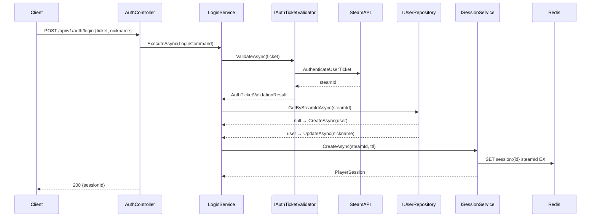
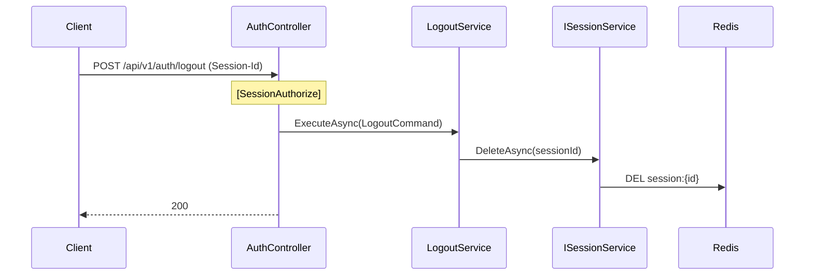
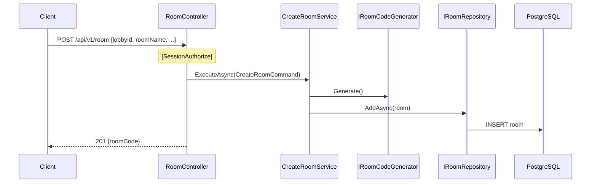
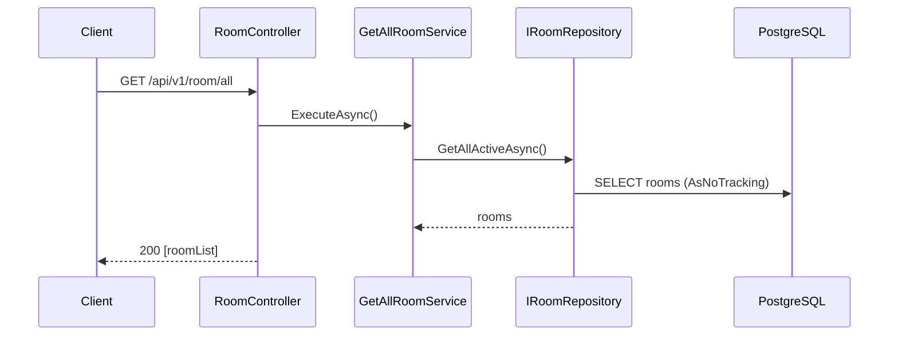
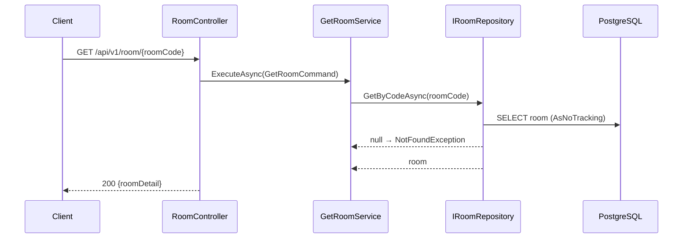
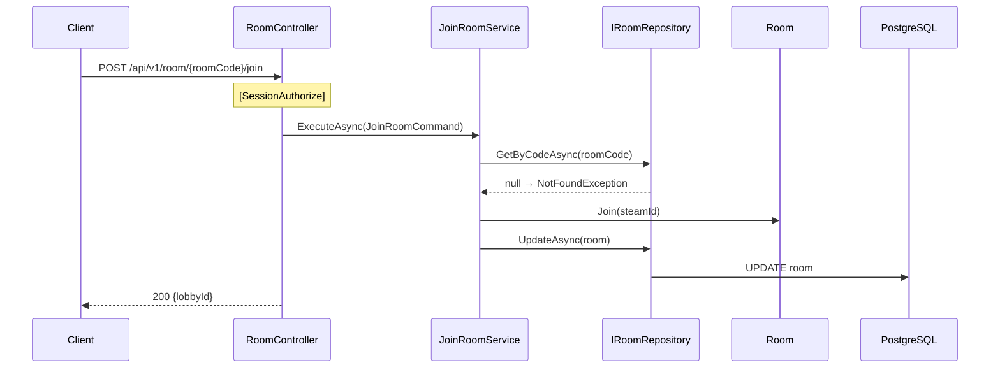

## API Flow Diagrams

### POST /api/v1/auth/login — Steam 로그인

### POST /api/v1/auth/logout — 로그아웃

### POST /api/v1/room — 방 생성

### GET /api/v1/room/all — 방 목록 조회

### GET /api/v1/room/{roomCode} — 방 상세 조회

### POST /api/v1/room/{roomCode}/join — 방 참여

